# 🌿 EasyClean™ v1.0 — Humanoid Olive Brush Cleaning System

()

**Author:** Christopher Perry  
**Version:** 1.0  
**Date:** September 18, 2025  
**Status:** Patent Pending – Manufacturing & Developer Specification  
**Brand:** EasyClean™  

 [!
[Build Status](https://img.shields.io/badge/Build-Passing-brightgreen.svg)]() 

This repository provides a **comprehensive, self-contained specification** for the EasyClean™ v1.0, a whimsical humanoid olive-shaped brush cleaning system for artists, educators, and young creators. It equips engineering and manufacturing teams with all details needed to prototype, assemble, and produce the unit from concept to completion. Included are mechanical dimensions, internal architecture, materials, BOM, electronics, wiring, compliance, manufacturing sequences, and USPTO-compliant visuals.

**Engineering Focus:**  
- Tolerances: ±0.05–0.2 mm  
- DFM Rules: 1.5–2 mm walls, 1° draft  
- Fluid Dynamics: 150 ml/min flow  
- Electrical Safeguards: IPX5, 2A fuse  

**Manufacturing Focus:**  
- Assembly: 5 min/unit cycle  
- Yield Target: 98%  
- QA Protocols: Flow test, leak check  
- Scalability: 10k units/month  
- BOM Cost: ~$15.25/unit (1k scale, excl. assembly)  

## 📖 Table of Contents

- [Introduction](#-introduction)
- [Design Philosophy](#-design-philosophy)
- [External Styling & Dimensions](#-external-styling--dimensions)
- [Internal Architecture](#️-internal-architecture)
- [PSU & Electronics](#-psu--electronics)
- [Materials](#️-materials)
- [Features](#-features)
- [Bill of Materials](#️-bill-of-materials)
- [Compliance & Safety](#-compliance--safety)
- [Manufacturing Handoff](#-manufacturing-handoff)
- [Wiring Diagram](#-wiring-diagram)
- [Visuals & Figures](#-visuals--figures)
- [Roadmap](#-roadmap)

---

## 📘 Introduction

EasyClean™ transforms brush maintenance into an **engaging, efficient ritual** for artists, educators, and young creators. Traditional cleaning methods cause bristle damage, pigment waste, and frustration. EasyClean™ counters this with a playful, olive-shaped design featuring:

- **Sealed Reservoir:** Refillable 280 ml tank for on-demand rinsing.  
- **Vortex Chamber:** Thorough pigment extraction without manual scrubbing.  
- **Ceramic Stone:** Rear-mounted for instant bristle reshaping and drying.  

This blend of **ergonomic utility** and **playful aesthetics** fosters consistent care habits in studios, classrooms, and homes, extending brush lifespan by up to 30% while minimizing mess.

**Key Performance Metrics:**
- **Cycle Time:** 40 s (powered) / 60 s (manual)  
- **Water Capacity:** 280 ml, 90% recirculation  
- **Pigment Removal:** 95% (vortex) vs. 70% (manual)  
- **Noise Level:** ≤35 dB  
- **Brush Compatibility:** 5–20 mm ferrules  
- **Runtime:** 150+ cycles/charge (1200 mAh LiPo, 25°C)  

**Build Overview:**
1. **Mechanical:** ASA shell (170×90×80 mm), CNC borosilicate tank, LSR seals.  
2. **Fluid System:** Polycarbonate chamber (Ø25 mm), nylon filter (150 µm), diatomaceous stone.  
3. **Electronics:** 40×30 mm PCB (BQ24075, TPS61023, NE555, DRV8873, N20 motor).  
4. **Assembly:** 8-step process, helium leak test, IPX5 QA.  
5. **Variants:** Manual, Powered Impeller, Pro Ultrasonic.  

---

## 🎨 Design Philosophy

<b>Click to Expand</b>

- **Form Meets Function:** Anthropomorphic olive silhouette offers intuitive handling ("hug" grip via arms/legs) and visual charm, turning a chore into a delightful experience.  
- **Daily Use Optimized:** Compact (170 mm height), child-safe (r <5 mm edges), modular (tool-free tank/stone swap).  
- **Sustainability First:** Recyclable ASA, biodegradable filter (50-cycle life), swappable battery/stone, low-energy boost converter (>85% efficiency).  
- **Playful Engagement:** "Winking" crown port (etched details) and optional bubble "glug" sounds gamify cleaning.  
- **DFM Principles:** 1.5–2 mm walls, 1° draft, <5% undercuts, matched CTE (ASA 70 ppm/°C, glass 9 ppm/°C, ±0.1 mm joints).

---

## 🫒 External Styling & Dimensions

- **Height:** 170 mm (6.7 in) – Balances portability and capacity.  
- **Width (Belly):** 90 mm (3.5 in) – Ergonomic for small hands (60–70 mm grip).  
- **Depth:** 80 mm (3.1 in) – Stable base (CoG 40 mm from base).  
- **Weight (Empty):** 250 g – Lightweight, weighted legs for stability.  
- **Color Palette:** Matte olive green (#4A7C59), translucent amber tank, laser-etched "character eyes" (0.1 mm depth).  

### Key Modules & Tolerances
| Module | Description | Dimensions | Material | Tolerance | Assembly Note |
|--------|-------------|------------|----------|-----------|---------------|
| **Top Crown Port** | Tapered silicone funnel, splash baffle, magnetic lid (NdFeB N52, Ø5 mm) | Ø30–15 mm, 20 mm height | LSR (Shore 70A, FDA-compliant) | ±0.05 mm taper, ±0.1 mm lid | Snap-fit to shell (101), 2–3 N closure |
| **Belly Tank** | Refillable reservoir, twist-lock, dual O-rings | 280 ml, Ø80 mm, 100 mm height | Borosilicate glass | ±0.2 mm thread (M25x1.5), ±0.2 ml | Torque 2.5 Nm, etched 100/200 ml marks |
| **Arms/Legs** | Posable limbs for brush hanging/stability | Arms: 45 mm, Ø8 mm; Legs: 35 mm, Ø10 mm | TPE silicone (Shore 30A) | ±1 mm length, ±0.5 mm durometer | Overmold, weighted legs (10 g each) |
| **Drying Stone** | Porous insert for reshaping/drying | 50×30×10 mm, 500–1000 µm voids | Diatomaceous earth, antimicrobial glaze | ±0.1 mm porosity, ±0.05 mm snap-fit | Rear slot, absorbs 5x weight |

**Ergonomics:** Curved contours (r=5 mm), non-slip base/grips (μ=0.8, TPE Ø12 mm pads), matte finish (Ra 1.6 µm).

---

## ⚙️ Internal Architecture

<b>Click to Expand</b>

### Fluid Dynamics Path
Recirculates 90% of 280 ml rinse water via closed loop, achieving 95% pigment removal. Flow: 150 ml/min (±10%), pressure drop <5 kPa.

1. **Entry (Brush Port):** Silicone sleeve (Shore 50A) guides bristles into 65 mm deep polycarbonate chamber (Ø25 mm, 1 mm wall). 5 mm anti-drip lip.  
2. **Agitation Zone:** 6-blade Delrin impeller (13 mm Ø, 200–300 RPM) with magnetic coupling (N52 Ø8×3 mm, 0.5 mm gap).  
3. **Filtration:** Conical nylon mesh (150 µm, 50 mm height), gravity return via Ø10 mm tube.  
4. **Exit/Refill:** Quarter-turn valve (Ø10 mm) or tank removal; Ø2 mm overflow vent (<300 ml).  

**Tolerances:** Chamber Ø ±0.1 mm, vane clearance 0.2 mm, mesh ±10 µm.

### Cleaning Modularity (SKU Variants)
| Variant | Mechanism | Cycle Time | RPM/Bubbles | Noise (dB) | Target Use | Key Tolerance |
|---------|-----------|------------|-------------|------------|------------|---------------|
| **A (Magnetic Impeller)** | Battery-powered N20 motor, magnetic coupling | 40 s | 200–300 RPM | ≤35 | Home/Studio | Air gap 0.5 mm ±0.1 mm |
| **B (Micro Air Pump)** | 3 V diaphragm pump, microbubbles | 45 s | 50–100 bubbles/s | ≤30 | Watercolor/Enzyme | Pressure 5 kPa ±1 kPa |
| **C (Ultrasonic Jet)** | 40 kHz piezo transducer ring | 20 s | 40 kHz | ≤40 | Professional | Frequency ±2 kHz, 1 W ±0.1 W |

**Manual Fallback:** Plunger rod (50 mm, Ø10 mm Delrin, stored in leg) for 20 strokes/cycle.

---

## 🔋 PSU & Electronics

<b>Click to Expand</b>

**Power Profile:**
- **Input:** USB-C PD (5 V/2 A max, IP67 cap).  
- **Battery:** 3.7 V 1200 mAh LiPo (50×30×5 mm, BMS/NTC, 60°C cutoff).  
- **Output:** TPS61023 boost to 6 V/1 A (4.7 µH inductor, >85% efficiency).  
- **Runtime:** 150+ 40 s cycles (25°C), low-battery throttle (<20% SoC).  
- **Charging:** BQ24075 (1 A CC/CV, 90 min full, C/10 trickle).  
- **Safeguards:** 6.5 V over-voltage, 2 A PTC fuse, NTC >60°C shutdown, 120 s idle auto-off.  

**User Interface:**
- **Button:** TTP223 capacitive (2 mm silicone dome, 1 pF), Start/Pause, >2 s mode toggle.  
- **Indicators:** WS2812B RGB ring (4 LEDs, Ø40 mm): Green (ready), Blue (active), Amber (<20%), Red (fault).  
- **Haptics (v1.1):** 3 V ERM motor (1 g, 150 Hz, 2 s pulse).  

**PCB Layout:**
- **Size:** 40×30 mm FR4 (1.6 mm, 2-layer, 2 oz Cu).  
- **Components:** SMD (0805/QFN), acrylic coating (25 µm, IPX5).  
- **Connectors:** JST PH 2.0 mm (battery/motor).  
- **Traces:** 1 mm (V6, 200 mA), 0.5 mm (signals), star ground (4 mm via).  
- **Decoupling:** 10 µF (VM), 100 µF (VSYS), 470 µF (V5).  

---

## 🏗️ Materials

| Category | Material | Key Properties | Rationale | Sourcing | Tolerance/Finish |
|----------|----------|----------------|-----------|----------|------------------|
| **Shell** | ASA copolymer (#4A7C59) | Impact-resistant (300 J/m), matte (Ra 1.6 µm) | Weather/chemical resistant, recyclable | Foxconn equiv. | 1.5–2 mm ±0.1 mm, 1° draft |
| **Tank** | Borosilicate glass (280 ml) | 92% transparent, ΔT 150°C | Dishwasher-safe, sediment monitoring | Schott AG equiv. | ±0.2 ml, M25x1.5 ±0.2 mm |
| **Seals** | Platinum-cured silicone | 70 Shore A, -40°C to 200°C | Hypoallergenic, >1M cycle life | DuPont | ±0.05 mm, AS568-012 |
| **Drying Stone** | Diatomaceous earth | 500–1000 µm voids, Ag-ion glaze | Reshapes, dries <2 min | Kyocera | ±0.1 mm porosity, ±0.05 mm snap-fit |
| **Base/Feet** | TPE pads | μ=0.8, Shore 60A | Vibration damping, floor protection | BASF | ±0.5 mm, bond >5 N |
| **Arms/Legs** | LSR | Shore 25A, tear >20 kN/m | Kid-safe, flexible | Dow | ±1 mm, bond >10 N |

**Note:** All materials RoHS/REACH compliant, food-grade for water contact.

---

## 🧩 Features

- **Adaptive Brush Port:** Silicone collar (Shore 50A) fits 5–20 mm ferrules, 5 mm anti-drip lip (>95% containment).  
- **Vortex Cleaning:** 95% pigment removal (200–300 RPM impeller), vs. 70% manual.  
- **Smart Tank:** Etched 100/200 ml marks, quarter-turn Ø10 mm valve.  
- **Reshape & Dry:** Stone wicks moisture <2 min, optional UV-C (v1.1, 254 nm, 5 mW).  
- **Accessibility:** Brailled buttons (0.5 mm raised), one-handed use (<2.5 Nm torque).  
- **Variants:** Manual ($29.99 est.), Powered ($39.99), Ultrasonic ($49.99).  
- **Eco Perks:** 90% water recycling, 50-cycle filter (bayonet swap).  

**Testing:** 1000 cycles, 1 m drop (6 sides), IPX5 microbial assay (24 hr).

---

## 🛠️ Bill of Materials (Option A: Magnetic Impeller)

| Subsystem | Component | Spec / Part # | Qty | Cost (USD, 1k units) | Supplier | Tolerance/Assembly |
|-----------|-----------|---------------|-----|----------------------|----------|-------------------|
| **Enclosure** | Outer shell | ASA mold, 170×90×80 mm | 1 | 2.50 | Protolabs equiv. | 1.5–2 mm ±0.1 mm, 1° draft |
| | Belly tank | Borosilicate, 280 ml | 1 | 1.80 | Schott AG equiv. | ±0.2 ml, M25x1.5 ±0.2 mm |
| | Crown seal | LSR funnel, Ø30–15 mm | 1 | 0.60 | Dow Corning equiv. | ±0.05 mm, Shore 70A |
| | Drying stone | Diatomaceous, 50×30×10 mm | 1 | 0.90 | Kyocera equiv. | 500–1000 µm ±0.1 mm |
| | Feet | TPE pads, Ø12 mm | 4 | 0.20 | 3M equiv. | ±0.5 mm, μ=0.8 |
| **Cleaning System** | Mesh filter | Nylon 150 µm, 50 mm H | 1 | 0.40 | Bayonet mount | ±10 µm, 50-cycle life |
| | Impeller | Delrin 6-blade, 13 mm Ø | 1 | 0.70 | CNC machined | 0.2 mm ±0.05 mm clearance |
| | Drive magnets | N52, Ø8×3 mm | 2 | 0.50 | Axial alignment | 0.5 mm ±0.1 mm gap |
| **Electronics** | Battery | 3.7 V 1200 mAh LiPo | 1 | 3.20 | UL 1642 certified | 50×30×5 mm, NTC β=3950 |
| | Charge IC | BQ24075 | 1 | 0.80 | TI equiv. | 1 A CC/CV, TS cutoff |
| | Boost conv. | TPS61023 (6 V/1 A) | 1 | 0.90 | TI equiv. | 4.7 µH, 88% eff. |
| | Motor driver | DRV8873 H-bridge | 1 | 1.10 | TI equiv. | VM 6 V, 1–20 kHz PWM |
| | Motor | 6 V N20, 100 RPM | 1 | 2.00 | Faulhaber equiv. | 0.5 Nm, 200 mA draw |
| | Touch button | TTP223 capacitive | 1 | 0.30 | Waterproof dome | 3.3 V OUT |
| | LED strip | WS2812B (4 LEDs, Ø40 mm) | 1 | 0.50 | Addressable | 5 V, 20 mA/LED |
| | USB-C port | IP67 receptacle | 1 | 0.70 | Dust cap | 5.1k pull-ups |
| **Seals & Mounts** | O-rings | Silicone AS568-012 | 2 | 0.10 | Parker Hannifin | <20% compression set |
| | Threadlocker | Loctite 243 | As req. | 0.05 | Loctite equiv. | 2.5 Nm torque |

**Total Cost:** ~$15.25/unit (1k scale). **Breakdown:** Enclosure 40%, Electronics 45%, Cleaning 15%. Assembly ~$2/unit.

---

## 🧪 Compliance & Safety

- **Electrical:** FCC Part 15 Class B (EMI <40 dBµV/m), CE (EN 62368-1), RoHS 3, UL 2054 (battery).  
- **Wet Environment:** IPX5 (12.5 L/min spray, 3 min), NSF/ANSI 61 (<0.25% lead).  
- **Child Safety:** ASTM F963 (3+), CPSIA (<0.1% phthalates), no small parts (>31 mm), BPA/BPS-free.  
- **Serviceability:** Replaceable filter (50 uses, <10 s), stone (yearly, <5 s), battery (2-year warranty, <30 s).  
- **Testing:**  
  - Durability: 1000 cycles (40 s, 25°C/50% RH).  
  - Drop: 1 m (6 sides, hardwood).  
  - Microbial: IPX5 (24 hr, ASTM G21).  
  - Leak: Helium (<10^-6 mbar l/s, 2 bar).  

**Risk Mitigation:** Fail-safe drain (>300 ml), app-free design, rounded edges (r >5 mm, <2 N pinch).

---

## 🏭 Manufacturing Handoff

<b>Click to Expand</b>

### Assembly Sequence (98% Yield, 5 min/unit)
1. **Molding:** ASA shell (45 s, 200°C melt, 80°C mold); TPE feet/arms overmold (30 s). Tooling: ~$50k. Inspect: 1.5–2 mm walls (±0.1 mm).  
2. **Tank Fabrication:** Borosilicate (blow/CNC M25x1.5); ultrasonic weld baffle (20 kHz, 5 s). Etch 100/200 ml marks. Inspect: 280 ml ±0.2 ml.  
3. **Sealing:** Robotic O-ring insertion (AS568-012); torque twist-locks (2.5 Nm ±0.2 Nm). Apply Loctite 243 (0.1 ml). Inspect: 0.05 mm ±0.05 mm gap.  
4. **Electronics:** SMT reflow (245°C, lead-free); laser weld battery tabs (1 J). Test: Continuity, 5 V/1 A charge. Coat: Acrylic (25 µm). Inspect: No shorts (<1 Ω).  
5. **Impeller:** Epoxy-bond magnet (N52 Ø8×3 mm, 5 min cure); calibrate gap (0.5 mm ±0.1 mm); press-fit Delrin impeller. Inspect: 200 RPM, no wobble >0.1 mm.  
6. **Drying Stone:** Kiln-fire ceramic (800°C, 2 hr); friction-fit (Ø2 mm pins). Ag-ion glaze (10 µm). Inspect: 5x weight absorption (60 s).  
7. **Final Integration:** Screw head (Torx T6, M3×10 mm, 1.5 Nm); insert plunger (friction >2 N). Helium leak test (<10^-6 mbar l/s). Inspect: 250 g ±5 g.  
8. **QA:** Automated: Flow (150 ml/min ±10%), timer (40 s ±2 s), IPX5 (3 min). Manual: Visual (Ra 1.6 µm). Reject: <2%.  

**Scalability:** 10k/month (parallel lines, 2 operators/line). Defect tracking: Flow (1%), leak (0.5%), electronics (0.5%).

### Packaging & Logistics
- **Box:** 220×120×120 mm recycled PET (1.2 mm, white litho); EVA foam cradle (±1 mm).  
- **Inserts:** A6 quick-start (4-color, fold-out), warranty card (2-year), 2-pack filter spares.  
- **Shipping:** UN 3481 (Li-ion, 100×100 mm label); 500 units/carton (600×400×300 mm, 15 kg).  

**Vendors:**  
- Enclosure: Xometry (steel molds, 100k shots).  
- Electronics: Jabil (IPC-A-610 Class 2).  
- Ceramics: CoorsTek (800°C kiln).

---

## 🔌 Wiring Diagram

<b>Click to Expand</b>

Graphviz DOT code for the powered variant (Option A) schematic. Covers power path (USB-C to LiPo/boost), control (NE555 40 s timer), loads (N20 motor, WS2812B LEDs), and optional sensors. Render with `dot -Tpng easyclean.dot -o wiring.png`.

```dot
// EasyClean™ v1.0 Wiring Diagram
// Project: EasyClean™ Humanoid Olive Brush Cleaning System
// Version: 1.0 (Powered Variant - Magnetic Impeller)
// Author: Christopher Perry
// Date: September 18, 2025
// Description: Wiring schematic for EasyClean v1.0, a brush cleaning device with 40s impeller cycle,
//              powered by USB-C (5V/1A) or 1200 mAh LiPo. Features NE555 timer control,
//              WS2812B LEDs, and optional sensors. For manufacturing and prototyping.
// Usage: Render with Graphviz (`dot -Tpng easyclean.dot -o wiring.png`)
// License: CC BY-SA 4.0 (pending patent review)

digraph EasyClean_Wiring_v1 {
  // ---------- GLOBAL STYLES ----------
  graph [rankdir=LR, splines=ortho, nodesep=0.5, ranksep=0.7, bgcolor=white];
  node  [shape=box, style=filled, fillcolor=whitesmoke, fontname="Inter", fontsize=10, penwidth=1.2];
  edge  [color=black, arrowsize=0.8, penwidth=1.0, fontname="Inter", fontsize=9, labeldistance=1.8, labelfontcolor="#333333"];

  // ---------- POWER NETS (diamonds) ----------
  VUSB  [label="USB-C 5V",         shape=diamond, fillcolor=lightblue];
  VSYS  [label="SYS 3.7–5V",       shape=diamond, fillcolor=lightblue];
  VBATT [label="LiPo 3.7V",        shape=diamond, fillcolor=lightpink];
  V5    [label="5V (LED/UI)",      shape=diamond, fillcolor=palegreen];
  V6    [label="6V (Motor)",       shape=diamond, fillcolor=palegreen];
  GND   [label="GND",              shape=diamond, fillcolor="#D9F2D9"];

  // ---------- CLUSTER: POWER PATH ----------
  subgraph cluster_power {
    label="Power Path"; labelloc=t; fontsize=12; color="#E8E8E8";
    USBC [label=<
      <b>USB-C</b><br/>Port
      <br/><font point-size="9">VBUS | CC1 | CC2 | GND</font>
    >];
    BQ   [label=<
      <b>BQ24075</b><br/>Charger/Power-Path
      <br/><font point-size="9">VBUS | SYS | BAT | TS</font>
    >];
    LIPO [label=<
      <b>LiPo Cell</b><br/>1200 mAh w/ BMS
      <br/><font point-size="9">+ | − | NTC</font>
    >];
    LDO33 [label=<
      <b>3.3V LDO</b><br/>(UI/Sense Reg)
      <br/><font point-size="9">IN | OUT | GND</font>
    >];
    LDO5  [label=<
      <b>MCP1700</b><br/>LDO → 5V
      <br/><font point-size="9">IN | OUT | GND</font>
    >];
    BOOST6 [label=<
      <b>TPS61023</b><br/>Boost → 6V
      <br/><font point-size="9">IN | SW | OUT | GND</font>
    >];
  }

  // ---------- CLUSTER: CONTROL CORE ----------
  subgraph cluster_control {
    label="Control Core"; labelloc=t; fontsize=12; color="#E8E8E8";
    TIMER [label=<
      <b>NE555</b><br/>Timer (40s)
      <br/><font point-size="9">VCC | TRIG | OUT | GND</font>
    >];
    DRV [label=<
      <b>DRV8873</b><br/>Motor Driver
      <br/><font point-size="9">VM | IN1 | IN2 | nSLEEP | OUTA | OUTB | GND</font>
    >];
  }

  // ---------- CLUSTER: ACTUATOR / LOADS ----------
  subgraph cluster_loads {
    label="Actuator / Loads"; labelloc=t; fontsize=12; color="#E8E8E8";
    MOTOR [label=<
      <b>N20 Motor</b><br/>6V Impeller
      <br/><font point-size="9">A | B | Mech</font>
    >];
    LEDS  [label=<
      <b>WS2812B Ring</b><br/>4 x LEDs
      <br/><font point-size="9">5V | DIN | GND</font>
    >];
  }

  // ---------- CLUSTER: SENSORS & UI ----------
  subgraph cluster_sense {
    label="Sensors / UI (Core + Optional)"; labelloc=t; fontsize=12; color="#E8E8E8";
    TOUCH [label=<
      <b>TTP223</b><br/>Touch Button
      <br/><font point-size="9">Vcc | OUT | GND</font>
    >];
    BADC  [label=<
      <b>Battery ADC</b><br/>Divider 100k/100k
      <br/><font point-size="9">Vbatt/2 | ADC | GND</font>
    >];
    subgraph cluster_optional_sensors {
      label="Optional (v1.1)"; fontsize=10; color="#D0D0D0"; style=dashed;
      WLVL  [label=<
        <b>Water Level</b><br/>Probe
        <br/><font point-size="9">Bias | ADC | GND</font>
      >];
      TURB  [label=<
        <b>Turbidity</b><br/>Sensor
        <br/><font point-size="9">Vcc | ADC | GND</font>
      >];
      HALL  [label=<
        <b>Lid Hall</b><br/>Sensor
        <br/><font point-size="9">Vcc | DO | GND</font>
      >];
    }
  }

  // ---------- GROUNDS ----------
  {edge [arrowhead=none, color="#8E8E8E"];
    USBC->GND; BQ->GND; LIPO->GND; LDO33->GND; LDO5->GND; BOOST6->GND;
    TIMER->GND; DRV->GND; MOTOR->GND; LEDS->GND; TOUCH->GND;
    BADC->GND; WLVL->GND; TURB->GND; HALL->GND;
  }

  // ---------- POWER FLOW ----------
  USBC -> VUSB [label="VBUS"];
  USBC -> GND  [label="CC1/CC2\n(5.1k pull-up)"];
  VUSB -> BQ   [label="VBUS"];
  BQ   -> VSYS [label="SYS"];
  BQ   -> LIPO [label="BAT"];
  LIPO -> VBATT;
  LIPO -> BQ   [label="NTC → TS"];

  VSYS -> LDO33 [label="IN"];
  VSYS -> LDO5  [label="IN"];
  VSYS -> BOOST6 [label="IN"];
  LDO5 -> V5    [label="5V"];
  BOOST6 -> V6  [label="6V"];

  // ---------- LOAD POWER ----------
  V6  -> DRV   [label="VM 6V"];
  DRV -> MOTOR [label="OUTA/OUTB"];
  V5  -> LEDS  [label="5V"];
  VSYS-> TOUCH [label="Vcc"];
  VSYS-> BADC  [label="Vref"];
  VSYS-> WLVL  [label="Bias (opt)"];
  VSYS-> TURB  [label="Vcc (opt)"];
  VSYS-> HALL  [label="Vcc (opt)"];

  // ---------- CONTROL LINES ----------
  TOUCH -> TIMER [label="OUT → TRIG\n(10k pull-down,\n1uF debounce)"];
  TIMER -> DRV  [label="OUT → nSLEEP"];
  LDO33 -> TIMER [label="3.3V → VCC"];
  LDO33 -> LEDS  [label="3.3V → DIN\n(100R series,\n470uF bulk on 5V)"];
  BADC  -> LDO33 [label="ADC → OUT"];
  WLVL  -> LDO33 [label="ADC → OUT (opt)"];
  TURB  -> LDO33 [label="ADC → OUT (opt)"];
  HALL  -> LDO33 [label="DO → OUT (opt)"];

  // ---------- RANK HINTS ----------
  {rank=same; VUSB; VSYS; VBATT; V5; V6; GND}
  {rank=same; USBC; BQ; LIPO; BOOST6; LDO33; LDO5}
  {rank=same; TIMER; DRV}
  {rank=same; MOTOR; LEDS; TOUCH; BADC}
  {rank=same; WLVL; TURB; HALL}

  // ---------- LEGEND ----------
  subgraph cluster_legend {
    label="Legend / Notes"; fontsize=11; color="#EFEFEF";
    LEG [shape=note, fillcolor="#FFFFF7", label=<
      <b>Engineering Notes</b><br align="left"/>
      • Diamonds = power nets; all tie to star ground at BQ GND<br align="left"/>
      • NE555: 40s cycle (100k R, 470uF C, pin 6/7 tied)<br align="left"/>
      • WS2812B: Static green/amber via LDO33; 470uF low-ESR cap on V5<br align="left"/>
      • Protections: 2A PTC fuse (BAT+), SMAJ5.0A TVS (VUSB)<br align="left"/>
      • PCB: 2oz Cu, 1mm V6 traces, 10uF decoupling on VM/DRV<br align="left"/>
      • Test Points: VUSB (5V), VSYS (3.7–5V), V5 (5V), V6 (6V), NE555 OUT<br align="left"/>
      • BOM Refs: DigiKey (BQ24075, TPS61023, MCP1700); Mouser (NE555, DRV8873)<br align="left"/>
      • Optional sensors (WLVL/TURB/HALL) for v1.1 roadmap<br align="left"/>
    >];
  }
}
```

**Wiring Notes:**
- **Power Path:** USB-C VBUS to BQ24075 (10 µF cap); SYS to LDO5 (5 V LEDs), BOOST6 (6 V motor), LDO33 (3.3 V timer/UI). NTC to TS pin (>60°C cutoff).  
- **Control:** TTP223 OUT to NE555 TRIG (10k pull-down, 1 µF); NE555 OUT to DRV8873 nSLEEP (40 s, 100k R/470 µF). DRV IN1/IN2 for forward (20 kHz PWM).  
- **Loads:** DRV OUTA/OUTB to N20 (22 AWG, 50 mm); WS2812B DIN from LDO33 (100 Ω, 470 µF on V5).  
- **Sensors:** BADC (100k/100k divider, ~1.85 V); optional WLVL/TURB/HALL (VSYS bias, 26 AWG).  
- **Protections:** 2 A PTC fuse (VBATT+), SMAJ5.0A TVS (VUSB/GND), star ground.  
- **PCB:** 2-layer FR4, ENIG finish, test points for VUSB/VSYS/V5/V6/NE555 OUT.

---

## 🖼️ Visuals & Figures

USPTO-compliant line art and renders for CAD, patent filing, and manufacturing. Images are 1024×1536 px, labeled with component numbers (e.g., 101 shell). Use for CAD dimensioning (FreeCAD/SolidWorks). Figures 1–8 provided; 9–12 are CAD generation guides.

### Provided Figures
| Figure | Description | Image |
|--------|-------------|-------|
| **FIG. 1 — Front Elevation** | Olive-shaped body (101), arms (130a, 130b), legs (131a, 131b), crown funnel (110), dashed tank (120). |  |
| **FIG. 2 — Internal Sectional** | Funnel (110) to tank (120), impeller (170), O-ring (121), stone (160), water flow arrows. |  |
| **FIG. 3 — Rear Elevation** | Stone (160), arms (130a, 130b), legs (131a, 131b), funnel (110), dashed tank (120). |  |
| **FIG. 4 — Top Plan** | Funnel (110), open lid (111), LED ring (140), arms. |  |
| **FIG. 5 — Perspective** | Isometric view: funnel (110), tank (120), LED ring (140), limbs (130a, 130b, 131a, 131b). |  |
| **FIG. 6 — Functional Diagram** | Brush in funnel (110), impeller (170), tank (120), stone (160), LED (140). |  |
| **FIG. 7 — Electrical Block** | USB-C (200), charger (202), battery (201), boost (203), regulator (204), sensor (205), timer (206), driver (207), motor (170), LED (140). |  |
| **FIG. 8 — Kickstarter Render** | Photorealistic desk view: tank (120), impeller (170), LED (140), funnel (110). |  |

### USPTO Figure Set (CAD Generation Guide)
Generate in CAD (FreeCAD/SolidWorks, 0.5 mm line weight, 1:1 scale). Use hatching: cross-hatch (glass), stipple (ceramic).

- **FIG. 1 — Front Elevation:** Shell (101), funnel (110), arms (130a, 130b), legs (131a, 131b), dashed tank (120). (Use FIG. 1 image.)  
- **FIG. 2 — Internal Sectional:** Funnel (110), tank (120), impeller (170), O-ring (121), stone (160), flow arrows. Vertical hatching for polycarbonate. (Use FIG. 2 images.)  
- **FIG. 3 — Rear Elevation:** Stone (160), arms (130a, 130b), legs (131a, 131b), funnel (110), dashed tank (120). (Use FIG. 3 image.)  
- **FIG. 4 — Top Plan:** Funnel (110), lid (111), LED ring (140). (Use FIG. 4 image.)  
- **FIG. 5 — Perspective:** Funnel (110), tank (120), LED (140), limbs (130a, 130b, 131a, 131b). (Use FIG. 5 image.)  
- **FIG. 6 — Functional Diagram:** Brush in funnel (110), impeller (170), tank (120), stone (160), LED (140). Add steps 1–5. (Use FIG. 6 image.)  
- **FIG. 7 — Electrical Block:** USB-C (200), charger (202), battery (201), boost (203), regulator (204), sensor (205), timer (206), driver (207), motor (170), LED (140). Add pin labels from DOT. (Use FIG. 7 image.)  
- **FIG. 8 — Exploded Assembly:** Funnel (110), shell (101), tank (120), O-ring (121), impeller (170), stone (160), LED (140), legs (131a, 131b). CAD: Vertical axis, callouts (0.5 mm leaders).  
- **FIG. 9 — Left Side Elevation:** Funnel (110), arm (130a), leg (131a), tank (120). CAD: Orthographic, dashed internals.  
- **FIG. 10 — Right Side Elevation:** Mirror of FIG. 9 (arm 130b, leg 131b). CAD: Symmetrical.  
- **FIG. 11 — Bottom View:** Drain, motor housing (170), legs (131a, 131b). CAD: Orthographic, Ø10 mm valve center.  
- **FIG. 12 — Process Flowchart:** Steps: (1) Brush in funnel (110), (2) Impeller (170) circulates water, (3) Pigment removal, (4) Stone (160), (5) LED (140). CAD: Boxed flowchart, arrows, based on FIG. 6.

---

## 🚀 Roadmap TBD Production year 

- **Q4 2025 (v1.0 Launch):** Manual/powered SKUs, art school beta (yield >98%, cost <$15/unit).  
- **Q2 2026 (v1.1):** Turbidity sensor (0–3.3 V, >50 NTU alert), BLE usage logs (nRF52, 10 m).  
- **Q4 2026 (v2.0):** Multi-fruit designs ("BerryBuddy"), biodegradable filter subscriptions.

---

**Get Started:**  
- **Engineering:** Model in CAD using figures/dimensions.  
- **Manufacturing:** Follow assembly sequence for prototypes.  
- **Issues/Questions:** Use GitHub Issues for feedback.  

---

